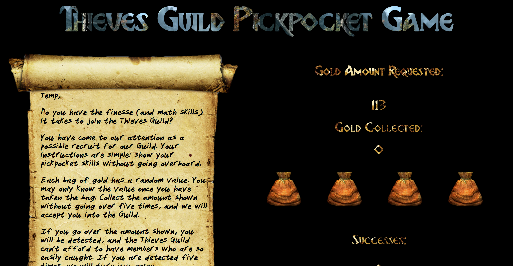

# Thieves Guild Pickpocket Challenge
Do you have the finesse (and the math skills) to join the Thieves Guild? Your challenge is to "steal" just enough gold to avoid being detected without going over the requested amount. Click the bags of gold to see how much each is worth. You may click them as many times as necessary to get to the desired sum. But if you go over, you'll be detected!

##See it in action.
When the screen loads, the user will type in his or her name. When the game loads, the following screenshot represents user view:

The user must click the gold pouches to see how much each is worth. If they are able to get the precise sum of money asked for, they will receive a point. The general gameplay is demonstrated below:

## Built With
Javascript, jQuery, responsive CSS

## Authors
Seton Raynor